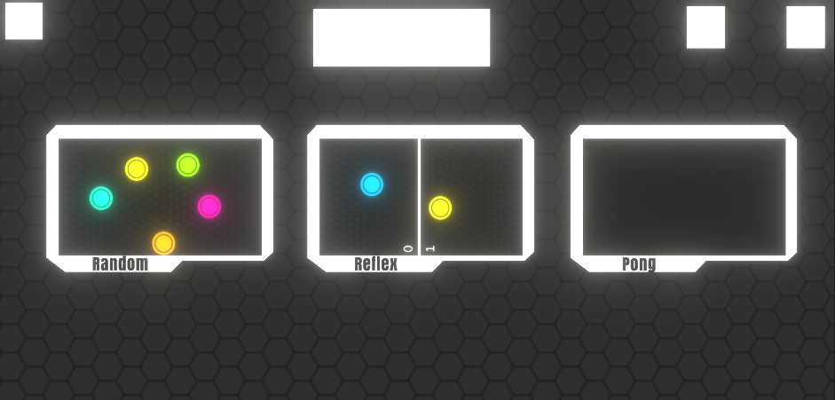

# Simple Minigames in Unity

This project was a venture into the world of game development, driven by the simple desire to have fun and learn. I embarked on creating a series of small minigames, each following a cohesive style. While the project remains unfinished, it served as a playground for exploring the capabilities of Unity.

The first minigame is a playful exercise where you and a friend place a finger on the screen, and the game randomly selects one person. This feature can be utilized for various activities, such as randomly assigning tasks or making decisions.

The second minigame divides the screen into two sides, challenging players to compete against each other. Periodically, a circle appears on the screen, and the player with the quickest reaction time to tap it earns a point. Both players are presented with the same images, albeit mirrored, adding to the competitive thrill.

The third game is a classic 2-player version of Pong, offering a simple yet entertaining experience.

Exploring game development in highschool was an enjoyable journey fueled by curiosity. Though unfinished, this project remains a testament to my interest in game development and the joy it brings.
